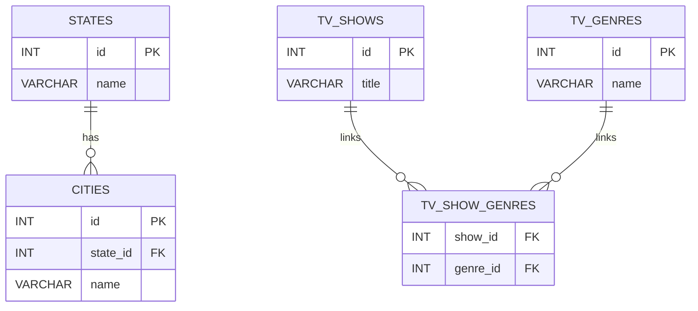

# 📊 SQL - More Queries

Welcome to the **SQL - More Queries** project at Holberton School!
This repository covers advanced SQL topics such as user management, data constraints, table relationships, joins, subqueries, and unions in MySQL 8.0.

---

## 📚 Learning Objectives

By the end of this project, you will be able to:

👉 Create and manage MySQL users
👉 Assign and inspect user privileges
👉 Use **NOT NULL**, **UNIQUE**, **PRIMARY KEY**, and **FOREIGN KEY** constraints
👉 Retrieve and relate data across multiple tables using `JOIN`, `UNION`, and **subqueries**
👉 Design a simple relational schema with linked tables

---

## 🧠 Concepts & Syntax Reference

### 👤 User & Privileges

```sql
-- Create user
CREATE USER 'user_0d_1'@'localhost' IDENTIFIED BY 'user_0d_1_pwd';

-- Grant privileges
GRANT ALL PRIVILEGES ON *.* TO 'user_0d_1'@'localhost';

-- Show privileges
SHOW GRANTS FOR 'user_0d_1'@'localhost';
```

---

### 🛡️ Constraints

| Constraint    | Description                    | Example                                        |
| ------------- | ------------------------------ | ---------------------------------------------- |
| `NOT NULL`    | Field must always have a value | `name VARCHAR(256) NOT NULL`                   |
| `UNIQUE`      | No duplicate values allowed    | `id INT UNIQUE`                                |
| `PRIMARY KEY` | Uniquely identifies each row   | `id INT PRIMARY KEY AUTO_INCREMENT`            |
| `FOREIGN KEY` | References another table’s key | `FOREIGN KEY (state_id) REFERENCES states(id)` |

---

### 🔗 Relationships with JOINs

#### 🎯 INNER JOIN

Returns rows with matching values in both tables.

```sql
SELECT cities.name, states.name
FROM cities
INNER JOIN states ON cities.state_id = states.id;
```

#### 🌐 LEFT JOIN

Returns all rows from the left table, even if there’s no match.

---

### 📆 Subqueries

Get values by querying inside another query.

```sql
SELECT name
FROM cities
WHERE state_id = (SELECT id FROM states WHERE name = 'California');
```

---

### 🔁 UNION

Combine results from multiple SELECTs (with same columns).

```sql
SELECT name FROM table_a
UNION
SELECT name FROM table_b;
```

---

## 🗃️ Project Structure

```bash
SQL_more_queries/
🔻 0-privileges.sql
🔻 1-create_user.sql
🔻 2-create_read_user.sql
🔻 3-force_name.sql
🔻 4-never_empty.sql
🔻 5-unique_id.sql
🔻 6-states.sql
🔻 7-cities.sql
🔻 8-cities_of_california.sql
🔻 9-cities_by_state_join.sql
🔻 10-genre_id_by_show.sql
🔻 11-genre_id_all_shows.sql
🔻 12-no_genre.sql
🔻 13-count_shows_by_genre.sql
🔻 14-my_genres.sql
🔻 15-comedy_only.sql
🔻 16-shows_by_genre.sql
```

---

## 🗂️ How to Run

Make sure MySQL service is running, then run scripts like this:

```bash
mysql -uroot -p < 1-create_user.sql
mysql -uroot -p hbtn_0d_usa < 6-states.sql
```

📌 Credentials for sandbox:

```bash
User: root
Password: root
```

---

## 📺 ER Diagram (Simplified)



---

## 🛠️ Requirements

* MySQL 8.0
* All queries must include comments at the top
* SQL keywords must be uppercase
* Files must end with a new line
* Use only allowed editors: `vim`, `vi`, `emacs`

---

## 🧪 Testing Example

```bash
cat 3-force_name.sql | mysql -uroot -p hbtn_0d_2
```

Then test insertion:

```bash
echo 'INSERT INTO force_name (id, name) VALUES (1, "Holberton");' | mysql -uroot -p hbtn_0d_2
```

---

## 🧠 Author

👨‍💻 Alejandro Garcia Sanchez
📚 Holberton School – San Juan Campus

